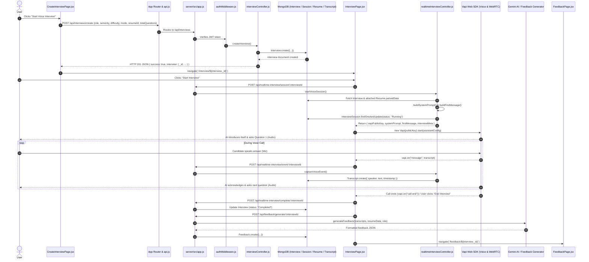

# PrepWise AI - Complete Interview Creation & Execution Flow

This document provides a comprehensive, step-by-step technical breakdown of everything that happens when you click the **"Start Voice Interview" / "Create Interview"** button in PrepWise AI.

---

## 1. High-Level Architecture & Lifecycle Flow



---

## 2. All Files Involved in the Entire Flow

### Frontend (Client-Side) Files
| File Path | Responsibility |
| :--- | :--- |
| `client/src/pages/CreateInterviewPage.jsx` | Captures interview preferences (Role, Seniority, Difficulty, Mode, Resume, Total Questions) and triggers API call. |
| `client/src/services/api.js` | Axios instance with baseURL (`/api`) and automatic JWT Authorization header interceptor. |
| `client/src/App.jsx` | React Router setup mapping `/create-interview`, `/interview/:id`, and `/feedback/:id`. |
| `client/src/pages/InterviewPage.jsx` | Main real-time voice interview room. Manages Vapi instance, WebRTC connection, live audio waveform, dual pulsing glowing orbs, call timer, and transcript syncing. |
| `client/src/pages/FeedbackPage.jsx` | Renders the post-interview scorecard, AI evaluation, question-by-question analysis, and strengths/weaknesses. |

---

### Backend (Server-Side) Files
| File Path | Responsibility |
| :--- | :--- |
| `server/src/app.js` | Express app configuration mounting `/api/interviews`, `/api/realtime-interview`, `/api/feedback`, and `/api/resume`. |
| `server/src/routes/interviewRoutes.js` | Defines `POST /api/interviews/create` and `PUT /api/interviews/:id/complete`. |
| `server/src/controllers/interviewController.js` | Handles creating new Interview documents in MongoDB and saving initial state. |
| `server/src/routes/realtimeInterviewRoutes.js` | Defines endpoints for starting session (`/session/:interviewId`), saving voice event logs (`/event/:interviewId`), and completing session (`/complete/:interviewId`). |
| `server/src/controllers/realtimeInterviewController.js` | Ingests candidate resume info, builds dynamic role/mode system prompts, starts voice sessions, and persists conversation logs. |
| `server/src/routes/feedbackRoutes.js` | Defines `POST /api/feedback/generate/:interviewId` and `GET /api/feedback/:interviewId`. |
| `server/src/controllers/feedbackController.js` | Orchestrates comprehensive AI evaluation from the final transcript and stores score metrics. |
| `server/src/middleware/authMiddleware.js` | Validates JWT token from the `Authorization: Bearer <token>` header and attaches `req.user`. |

---

### Database Models (`server/src/models/`)
| Model File | Schema Description |
| :--- | :--- |
| `Interview.js` | Stores interview configuration (`role`, `seniority`, `difficulty`, `mode`, `totalQuestions`, `status`, `startedAt`, `endedAt`, `user`, `resume`). |
| `InterviewSession.js` | Tracks live session state (`sessionStatus: 'Running' \| 'Ended'`). |
| `Resume.js` | Holds uploaded resume details and AI-parsed data (`skills`, `technologies`, `projects`, `experience`, `education`, `atsScore`). |
| `Transcript.js` | Stores individual speech turns (`speaker: 'AI' \| 'User'`, `text`, `timestamp`, `isFinal`). |
| `Feedback.js` | Stores comprehensive feedback, overall score, category breakdown scores, strengths, areas of improvement, and detailed feedback for each question. |

---

## 3. Step-by-Step Flow of Execution

### Step 1: Form Interaction & Button Click
1. **User Action**: The user fills out the form on `CreateInterviewPage.jsx` and clicks **"Start Voice Interview"**.
2. **Validation**: `handleGenerate()` in `CreateInterviewPage.jsx` validates that `formData.role` is not empty.
3. **Payload Created**:
   ```json
   {
     "role": "Full Stack Developer",
     "seniority": "Junior",
     "difficulty": "Medium",
     "totalQuestions": 5,
     "resumeId": "65b...",
     "mode": "Technical",
     "title": "Full Stack Developer Interview",
     "interviewType": "Voice"
   }
   ```

### Step 2: Backend Interview Record Creation
1. **Request**: `api.post("/interviews/create", payload)` sends HTTP POST with JWT token.
2. **Middleware**: `authMiddleware.js` verifies the token and attaches `req.user`.
3. **Controller**: `interviewController.createInterview()` creates a new document in MongoDB using the `Interview` model:
   - Sets `status: "Active"`
   - Sets `startedAt: new Date()`
   - Associates `req.user._id` and `resumeId`
4. **Response**: HTTP 201 JSON returning `{ success: true, interview: { _id, ... } }`.

### Step 3: Frontend Navigation to Interview Room
1. `CreateInterviewPage.jsx` receives `response.data.interview._id`.
2. Calls `navigate(`/interview/${response.data.interview._id}`)`.
3. `InterviewPage.jsx` is mounted for this specific interview ID.

### Step 4: Starting the Voice Session & Building Dynamic Prompt
1. In `InterviewPage.jsx`, when the user clicks **"Start Interview"** (or auto-starts):
2. Calls `api.post(`/realtime-interview/session/${id}`)`.
3. `realtimeInterviewController.startVoiceSession()` executes:
   - Finds the `Interview` document by ID.
   - If a `resume` is attached, fetches `Resume.findById()` and retrieves `resume.parsedData` (skills, projects, technologies, experience).
   - Injects the mode guide (e.g. Technical, HR, Behavioral, System Design, DSA).
   - Calls `buildSystemPrompt()` to generate a hyper-personalized system prompt instructing the AI interviewer to ask questions tailored to the candidate's exact resume and seniority.
   - Calls `buildFirstMessage()` to generate the opening audio greeting.
   - Upserts `InterviewSession` document to `sessionStatus: "Running"`.
4. Returns `{ vapiPublicKey, systemPrompt, firstMessage, interviewMeta }` to the client.

### Step 5: Vapi WebRTC Connection & Live Conversation
1. `InterviewPage.jsx` initializes `new Vapi(publicKey)`.
2. Attaches event listeners:
   - `vapi.on("call-start")` -> Sets `isLive: true`, starts the call timer.
   - `vapi.on("speech-start")` / `speech-end` -> Toggles glowing AI orb animation.
   - `vapi.on("message")` -> Captures real-time transcript from speech-to-text.
3. Calls `vapi.start(assistantConfig)` passing inline system prompt, voice ID (`alloy`), and model (`gpt-4o-mini`).
4. **Real-time Conversation Loop**:
   - AI speaks first message & Question 1 over audio.
   - User speaks back into microphone.
   - For every speech utterance, `persistTranscriptTurn()` sends `POST /api/realtime-interview/event/:id`.
   - `realtimeInterviewController.captureVoiceEvent()` saves speech turns in MongoDB via `Transcript.create()`.
   - The AI interviewer counts questions, asks follow-ups/subsequent questions, and upon reaching the question limit, says the closing phrase and ends the call.

### Step 6: Interview Completion & AI Feedback Generation
1. When call ends (via `vapi.on("call-end")` or user clicking "End Interview"):
   - `stopInterview()` is triggered.
   - Sends `POST /api/realtime-interview/complete/:id` -> Marks `Interview` as `Completed` and sets `endedAt`.
   - Sends `POST /api/feedback/generate/:id` -> `feedbackController.generateInterviewFeedback()`.
2. `feedbackGenerator.js` retrieves the complete transcript from MongoDB and calls Google Gemini AI.
3. Gemini generates a structured breakdown:
   - Overall Score (0-100)
   - Category scores (Technical, Communication, Problem Solving)
   - Key Strengths & Areas for Improvement
   - Question-by-question evaluation with model answers and critique.
4. Feedback is saved to `Feedback` model in MongoDB.
5. `InterviewPage.jsx` navigates to `navigate(`/feedback/${id}`)` where `FeedbackPage.jsx` displays the results.

---

## 4. Summary of Execution Flow

```
[CreateInterviewPage.jsx] 
   └── api.post('/interviews/create')
       └── [interviewRoutes.js] -> [authMiddleware.js] -> [interviewController.js]
           └── MongoDB: Interview.create()
               └── Client navigates to /interview/:id [InterviewPage.jsx]
                   └── api.post('/realtime-interview/session/:id')
                       └── [realtimeInterviewController.js] (Embeds Resume + System Prompt)
                           └── Vapi SDK connects WebRTC Voice
                               └── Live Audio Interview & Transcript Logging [Transcript.js]
                                   └── Call End -> api.post('/feedback/generate/:id')
                                       └── Gemini AI evaluates transcript
                                           └── Navigate to [FeedbackPage.jsx]
```
