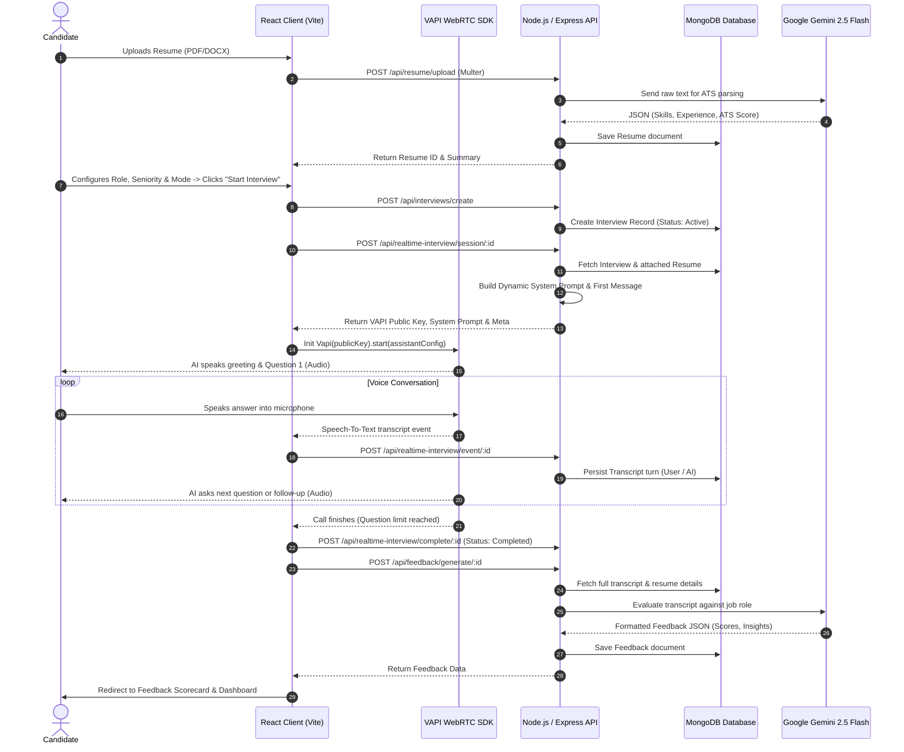

# 🚀 PrepWise AI - Complete Interview Presentation & Project Guide

This guide is specifically designed to help you explain **PrepWise AI** confidently to an interviewer. It covers the elevator pitch, architecture, tech stack decisions, technical challenges, and key interview Q&A.

---

## 📌 1. The 30-Second Elevator Pitch

> *"PrepWise AI is a full-stack, production-ready AI interview preparation platform that enables job seekers to conduct realistic, real-time voice interviews with an AI interviewer. Unlike static Q&A platforms, PrepWise AI parses the candidate's resume (PDF/DOCX) to extract their skills, projects, and work experience, then dynamically customizes voice interview questions tailored to their target role, seniority level, and exact resume details using VAPI WebRTC voice technology and Google Gemini 2.5 Flash. After the interview, it provides an in-depth scorecard with question-by-question critiques, category scores, and performance analytics."*

---

## 🎯 2. Project Overview & Problem Statement

### The Problem
- Job candidates struggle with mock interviews because traditional practice is either expensive (peer/mentor coaching) or static (text-based flashcards).
- Generic interview prep doesn't ask questions relevant to a candidate’s specific resume or target job role.
- Candidates lack immediate, unbiased technical feedback on their spoken answers, speech clarity, and problem-solving depth.

### The Solution: PrepWise AI
1. **Real-time Voice AI Interviewer**: Simulates a live phone/video screening using **VAPI WebRTC Web SDK**, allowing candidates to speak naturally through their microphone.
2. **Resume ATS & Skill Extraction**: Parses uploaded PDFs/DOCX files, generates an ATS compliance score, extracts core technologies, and feeds this context into the interview room.
3. **Adaptive Prompt Engineering**: Dynamically injects resume context and interview modes (Technical, HR, Behavioral, System Design, DSA) into system prompts.
4. **Automated AI Scorecard**: Evaluates transcripts via **Google Gemini 2.5 Flash**, giving overall scores (0-100), category breakdowns, strengths, growth areas, and ideal sample answers.
5. **Analytics Dashboard**: Tracks score trends over time using interactive radar and line charts.

---

## 🏗️ 3. Tech Stack & Architectural Justifications

| Layer | Technology | Why Chosen / Technical Rationale |
| :--- | :--- | :--- |
| **Frontend Framework** | **React.js (v18) + Vite** | High-speed HMR, lightweight bundle size, and fast component re-rendering. |
| **UI & Styling** | **Tailwind CSS (v4) + Framer Motion** | Tailwind for responsive design system; Framer Motion for smooth micro-animations (pulsing audio waveform, glowing AI orb). |
| **State & Routing** | **Zustand + React Router v7** | Zustand provides a minimal footprint global state for user authentication without the boilerplate of Redux. |
| **Voice Engine** | **VAPI Web SDK** | Handles ultra-low latency bi-directional WebRTC audio streaming, Voice Activity Detection (VAD), and turn-taking. |
| **Backend API** | **Node.js + Express.js (v5)** | Event-driven, non-blocking I/O ideal for handling multiple asynchronous API requests and continuous transcript syncing. |
| **Database** | **MongoDB + Mongoose** | Flexible JSON schema perfect for storing unstructured resume data, multi-turn interview transcripts, and dynamic AI feedback objects. |
| **AI Processing** | **Google Gemini 2.5 Flash** | Sub-second response times, large context window for long transcripts, and highly reliable JSON output mode for scorecards. |
| **File Parser** | **Multer + PDF-Parse + Mammoth** | Extracts clean text content from PDF and Word resumes directly in memory buffers. |
| **Auth** | **JWT (JSON Web Tokens) + bcryptjs** | Stateless authentication with secure password hashing. |

---

## 🔄 4. End-to-End System Flow & Architecture

---

## ⚡ 5. Key Technical Challenges & How You Solved Them

### Challenge 1: Low-Latency Real-Time Voice Duplex & Interruption Handling
* **Problem**: Standard HTTP requests cause a 2–4 second lag between candidate speech and AI response, killing the immersion of a real interview.
* **Solution**: Integrated **VAPI Web SDK** using WebRTC streaming over WebSockets. Implemented real-time listener events (`speech-start`, `speech-end`, `message`) on the frontend to control UI audio waveforms and dynamic glowing orb animations instantly.

### Challenge 2: Dynamic Resume-Aware System Prompt Engineering
* **Problem**: AI interviewers often ask generic questions unrelated to the candidate’s actual background.
* **Solution**: Built a dynamic prompt generator (`buildSystemPrompt`) in the backend. When starting a session, the server parses the candidate's MongoDB resume document (`skills`, `projects`, `experience`) and mode parameters (Technical, Behavioral, System Design, DSA, HR). It injects explicit instructions forcing the LLM to ground its questions in the candidate's actual projects.

### Challenge 3: Real-Time Transcript Persistence Without Blocking Audio
* **Problem**: Saving every turn of conversation to MongoDB during an ongoing WebRTC call could cause network congestion or stuttering.
* **Solution**: Designed an asynchronous endpoint `POST /api/realtime-interview/event/:id` that receives intermediate transcript events from the frontend and asynchronously writes turn-by-turn speech objects (`speaker`, `text`, `timestamp`, `isFinal`) into MongoDB without blocking the frontend audio stream.

### Challenge 4: Ensuring Structured JSON Output from Gemini for Scorecards
* **Problem**: LLMs can produce unstructured markdown or conversational text, which breaks frontend UI rendering for charts and scorecards.
* **Solution**: Utilized Gemini's structured JSON output mode with strict TypeScript-style schema definitions in system prompts. Enforced fallback JSON extraction regex patterns on the backend to guarantee consistent parsing of category scores, radar metrics, and per-question reviews.

---

## 💬 6. Expected Interviewer Questions & Model Answers

### Q1: "Walk me through the architecture of your project."
> **Answer**: "PrepWise AI follows a modern decoupled MERN architecture enhanced with AI streaming. On the frontend, we use React with Vite and Tailwind CSS. The state is managed via Zustand. When a candidate starts a voice session, the React client communicates with our Node.js/Express backend to initialize an interview session. The backend retrieves the user's resume data from MongoDB, constructs a tailored system prompt, and sends connection parameters to the frontend. The frontend then establishes a WebRTC connection with VAPI for real-time voice streaming. Transcripts are persisted asynchronously to MongoDB, and upon completion, Google Gemini processes the full transcript to generate a structured feedback scorecard."

---

### Q2: "Why did you choose MongoDB instead of PostgreSQL?"
> **Answer**: "MongoDB was chosen primarily because of the schema flexibility required for our core features:
> 1. **Resume Extraction**: Resumes contain variable numbers of projects, skills, education entries, and custom fields that map cleanly to document embedding.
> 2. **Transcripts**: Interview transcript turns vary in length and structure per session.
> 3. **AI Feedback Scorecards**: Gemini produces deep hierarchical JSON objects containing category breakdowns, question reviews, and radar chart metrics. Storing these natively as JSON documents in MongoDB avoided complex multi-table relational joins."

---

### Q3: "How does the Resume ATS Scoring system work?"
> **Answer**: "When a user uploads a PDF or DOCX file:
> 1. **Multer** handles the file upload in memory.
> 2. `pdf-parse` or `mammoth` extracts raw plaintext.
> 3. The extracted text is passed to Google Gemini with a prompt instructing it to analyze formatting, keyword matching, section completeness, and industry alignment.
> 4. Gemini returns an overall **ATS Score (0-100)**, extracted technical skills, projects, work experience, and actionable improvement recommendations, which are saved in MongoDB."

---

### Q4: "How would you scale this application to handle 100,000 active concurrent interviews?"
> **Answer**: "To scale PrepWise AI to 100,000 concurrent sessions, I would make the following architectural upgrades:
> 1. **Message Queue for AI Evaluation**: Offload Gemini feedback generation from HTTP request handlers to an asynchronous worker queue using **RabbitMQ** or **Apache Kafka**.
> 2. **Redis Caching**: Cache user sessions, resume metadata, and auth tokens in Redis to reduce database read pressure on MongoDB.
> 3. **Database Sharding**: Partition MongoDB collections by `userId` to distribute read/write throughput across a replica cluster.
> 4. **Load Balancing & Stateless Backend**: Deploy the Node.js API servers in a containerized environment (Docker + Kubernetes) behind an NGINX load balancer."

---

## 📈 7. Project Key Features Summary Checklist

- [x] **Real-Time WebRTC Voice AI Interviews** (VAPI Integration)
- [x] **Resume ATS Parser & Skill Extraction** (PDF-Parse / Mammoth + Gemini)
- [x] **5 Specialized Interview Modes** (Technical, HR, Behavioral, System Design, DSA)
- [x] **Seniority & Difficulty Calibration** (Junior, Mid, Senior, Lead)
- [x] **Automated AI Scorecard & Detailed Question Critique** (Gemini 2.5 Flash)
- [x] **Performance Analytics & Radar Charts** (Recharts)
- [x] **JWT Authentication & Protected Routing**
- [x] **Modern Responsive UI with Glowing Orb Animations** (Framer Motion + Tailwind CSS)

---

> 💡 **Pro-Tip for Your Interview**: Focus on **why** you made specific choices (e.g. why WebRTC via VAPI for voice latency, why Gemini for cost/speed balance, why asynchronous transcript logging). Interviewers love hearing about real architectural trade-offs!
